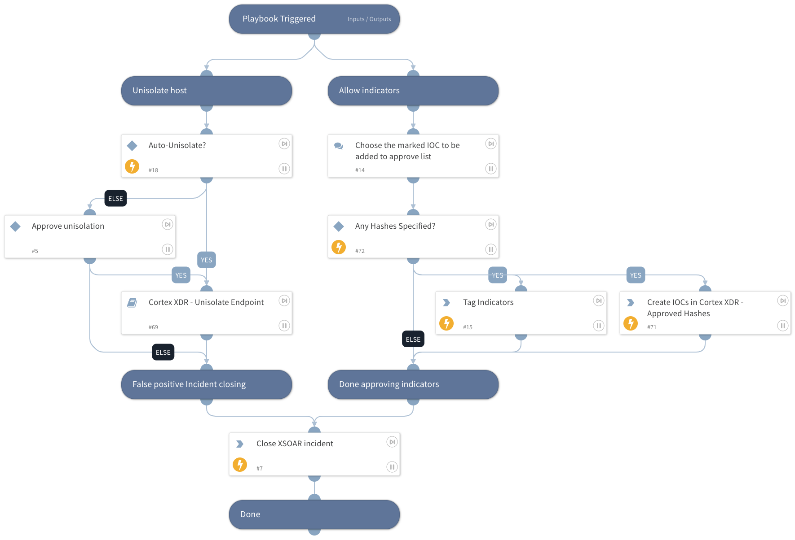

This Playbook handles a false-positive incident closure for Cortex XDR - Malware investigation.

## Dependencies
This playbook uses the following sub-playbooks, integrations, and scripts.

### Sub-playbooks
* Cortex XDR - Unisolate Endpoint

### Integrations
* CortexXDRIR

### Scripts
This playbook does not use any scripts.

### Commands
* xdr-allowlist-files
* setIndicators
* closeInvestigation

## Playbook Inputs
---

| **Name** | **Description** | **Default Value** | **Required** |
| --- | --- | --- | --- |
| Comment | Add comment to close an incident on the Microsoft Defender For Endpoint side | XSOAR Incident #${incident.id} | Optional |
| Reason | Choose From - "Unknown" / "TruePositive" / "FalsePositive" | FalsePositive | Optional |
| AllowTag | Specify the approving tag name for found indicators. | AllowTag | Optional |
| AutoUnisolation | Indicates if automatic un-isolation is allowed     True/False | False | Optional |
| HostID | The ID of the host for running an un-isolation process. | ${incident.deviceid} | Optional |
| FileSha256 | Enter the File Sha256 you would like to block. | ${incident.filesha256} | Optional |

## Playbook Outputs
---
There are no outputs for this playbook.

## Playbook Image
---
