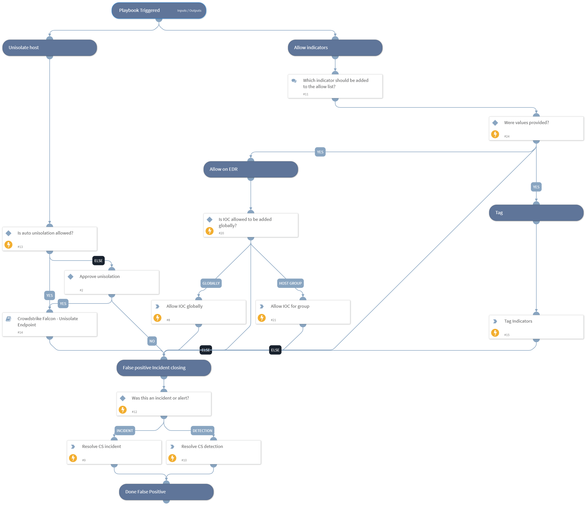

The playbooks allows to handle a CrowdStrike incident that was determined to be a false positive by the analyst. Actions include unisolating the host, allowing the indicator by the EDR as well as tagging it.

## Dependencies
This playbook uses the following sub-playbooks, integrations, and scripts.

### Sub-playbooks
* Crowdstrike Falcon - Unisolate Endpoint

### Integrations
* CrowdStrikeFalcon

### Scripts
This playbook does not use any scripts.

### Commands
* setIndicators
* cs-falcon-upload-custom-ioc
* cs-falcon-resolve-incident
* cs-falcon-resolve-detection

## Playbook Inputs
---

| **Name** | **Description** | **Default Value** | **Required** |
| --- | --- | --- | --- |
| AutoUnisolation | Indicates if automatic un-isolation is allowed True/False | false | Optional |
| HostId | The host ID to unisolate. |  | Optional |
| AllowIOCTagName | The name of the tag to apply to allowed indicators. |  | Optional |
| ApplyAllowIOCGlobally | Indicates if adding to allow list is globally If specified False provide an input for the AllowHostGroup input with the group name. True/False | True | Optional |
| AllowHostGroupName | The name of the allow list group to apply in case ApplyAllowIOCGlobally isn't set as True. |  | Optional |
| CloseNotes | Provide the close notes to be listed in CrowdStrike. |  | Optional |
| Sha256 | The SHA256 value to manage. |  | Optional |

## Playbook Outputs
---
There are no outputs for this playbook.

## Playbook Image
---
