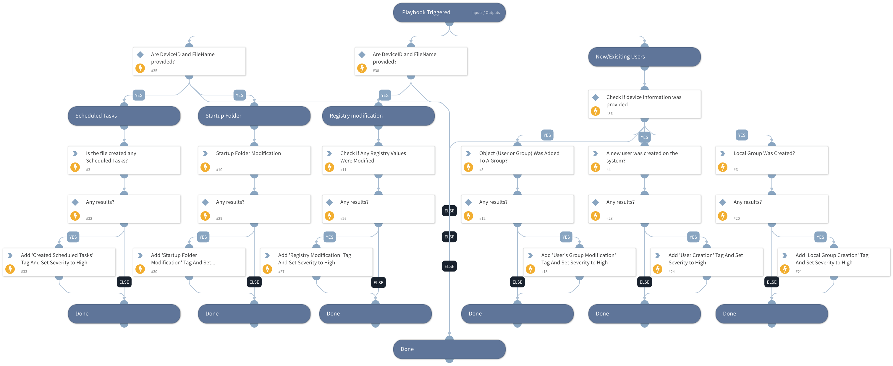

This playbook will use the Microsoft Defender For Endpoint feature - Advanced Hunting - and will hunt for host persistence evidence.

## Dependencies
This playbook uses the following sub-playbooks, integrations, and scripts.

### Sub-playbooks
This playbook does not use any sub-playbooks.

### Integrations
* MicrosoftDefenderAdvancedThreatProtection

### Scripts
This playbook does not use any scripts.

### Commands
* microsoft-atp-advanced-hunting-persistence-evidence
* setIncident

## Playbook Inputs
---

| **Name** | **Description** | **Default Value** | **Required** |
| --- | --- | --- | --- |
| FileSha256 | Enter File Sha256 to hunt on. Can be a comma-separated list. | incident.filesha256 | Optional |
| FileSha1 | Enter File Sha1 to hunt on. Can be a comma-separated list. | incident.filesha1 | Optional |
| FileMd5 | Enter File MD5 to hunt on. Can be a comma-separated list. | incident.filemd5 | Optional |
| IP | Enter an IP to hunt on.  Can be a comma-separated list. | incident.detectedips | Optional |
| DeviceName | Enter a Hostname to hunt on.  Can be a comma-separated list. | incident.hostnames | Optional |
| FileName | Enter a File name to hunt on.  Can be a comma-separated list. | incident.filenames | Optional |
| DeviceID | Enter a device ID to hunt on.  Can be a comma-separated list. | incident.agentsid | Optional |

## Playbook Outputs
---
There are no outputs for this playbook.

## Playbook Image
---
